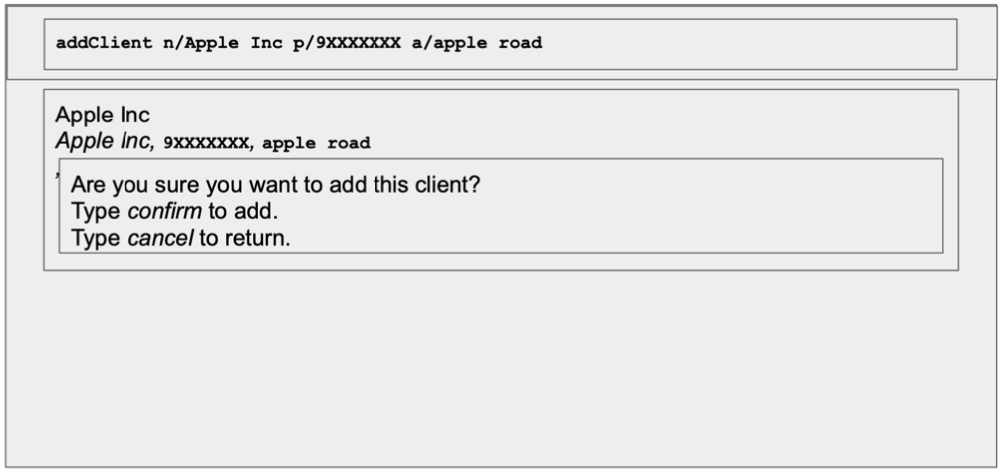
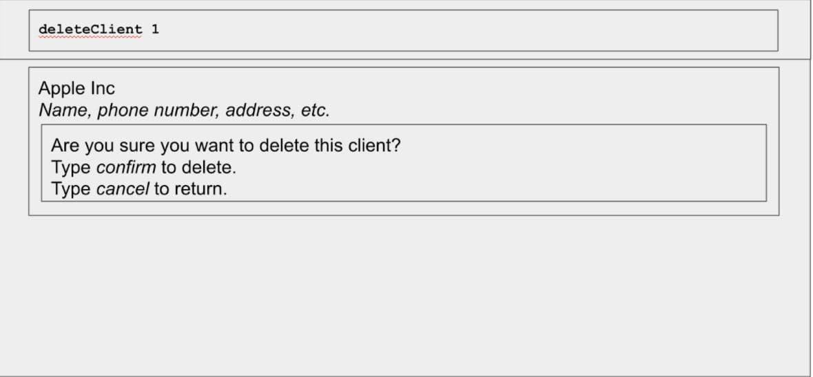
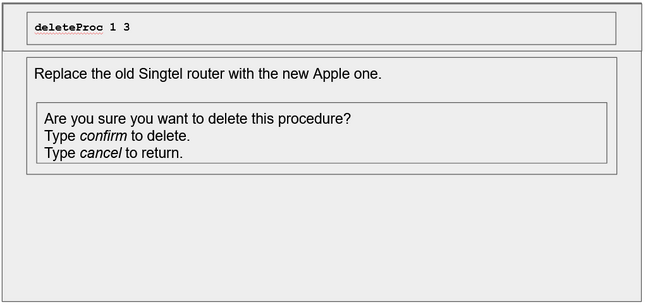
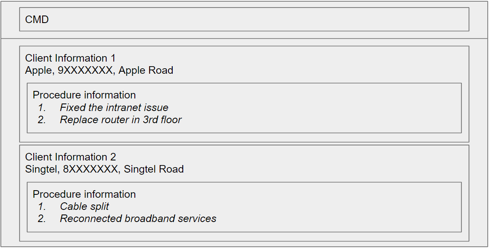

*Networkers* is a **desktop app for managing contacts for networks, 
optimised for use via a Command Line Interface** (CLI) 
while still having the benefits of a Graphical User Interface (GUI). 
If you can type fast, Networkers can get your contact management tasks 
done faster than traditional GUI apps.

- **Features (v1.2)**
  1. Add a client
  2. Delete a client
  3. Add a procedure to the client
  4. Delete a procedure from the client
  5. View all clients and associated procedures in the client
  6. Calculate the cost of all procedures on a specified date
- **Command Summary**

--------------------------------------------------------------------------------------------------------------------

## Features

### Add a Client: `addClient`

Adds a Client with an empty procedure list to the address book

Format: `add n/NAME p/PHONE_NUMBER e/EMAIL a/ADDRESS [t/TAG]...`
 - `addClient` refers to the command of adding a client to the address book
 - Mandatory details include a name, phone_number and an address for the client

Examples:

Non GUI format:
- User: `addClient n/Apple Inc p/9XXXXXXX a/apple road`
  - Terminal returns: `Added client apple inc to the tasklist`

GUI format: 

### Deleting a client: `deleteClient`

Deletes a specified client from  the contact book.

Format: `deleteClient <INDEX>`

* Deletes the client at the specified INDEX.
* The index refers to the index number shown in the displayed contact list.
* The index must be a positive integer 1, 2, 3, …

User must then type `confirm` in order to delete the client. Users may type cancel instead to return to the main command line.

Examples:

Non-GUI Format:
* `deleteClient 1` will trigger an attempt to delete the 1st client in the contact list .
* Users must type `confirm` to delete, or cancel to return to the main command line.

GUI Format:

### Add a Procedure to a Client: `addProc`

Adds a specified procedure to a specified client list in the contact book.

**Format:** `addProc <Client Index> <Procedure>`
* `addProc` refers to the command of adding a procedure to the client at the specified Index.
* `<Client Index>` refers to the index number shown in the displayed client list. The index **must be** a positive integer 1, 2, 3, …​
* `<Procedure>` refers to the tasks or problems that need to be addressed in the future visits to the client’s business sight.
  * Note that a client’s list of procedures is a numbered list. A new procedure will be added on to the existing numbered list (to the last index).

**Example:**  
Non-GUI Format:
* `addProc 1 Check router’s connection with the modem`
  * In the case that the 1st client already has existing procedures, `Check router’s connection with the modem` procedure will appear to be the last procedure in that client’s procedure list.

GUI Format:

### Delete a Procedure from the client: `deleteProc`

Deletes a procedure associated with the client. This is important as it allows the user to maintain and make changes to the database - creation and deletion.

**Format:** `deleteProc <clientIndex> <Proc_Index>`
A new procedure will be deleted from the existing numbered list.
* `deleteProc` refers to the command of deleting a procedure from the client at the specified Index.
* `<Client Index>` refers to the index number shown in the displayed client list. 
The index must be a positive integer 1, 2, 3, ...
* `<Procedure>` refers to the tasks or problems that need to be addressed 
in the future visits to the client’s business sight.
Note that a client’s list of procedures is a numbered list. 

**Example:**
Non-GUI format:
User: deleteProc 1 3
Terminal returns: The procedure “Bring a new Singtel router to replace the old Apple one” has been successfully deleted! :)
User: deleteProc 3 500
Terminal returns: The procedure you listed does not exist, add more procedures.
User: deleteProc 3
Terminal returns: Do add in the procedure you would like to delete and try again :).

GUI Format:

### Calculate the cost of all procedures on a specified date: `calculate`

Calculates the cost of all procedures that happen any time on a specified date 
in the format of dd/MM/uuuu, eg. 23/03/2022

Format: `calculate 23/03/2022`
- `calculate` refers to the command of calculating cost on a specified date
- Mandatory details include a valid date

Valid date:
A valid date has to 
1. be in the specified format of **dd/MM/uuuu** 
2. be an accurate date, taking leap years into account 

User will be prompted if the date is invalid

Example: 
- User: `calculate 23/03/2022`
- Terminal returns: 

Non-GUI Format

Total Cost: 31.50 

GUI Format:

### View All Clients: `list`

Lists out all the clients saved.
This feature will be used to show clients on GUI. No arguments required.
Example:
- User: `list`
- Terminal returns:

Non-GUI Format
1. Apple, 9XXXXXXX, Apple Road
2. Singtel, 8XXXXXXX, Singtel Road

GUI Format:

### View All Procedures of a Client

Lists out all the procedures related to a Client.

Example:
- User: `listProc 1`
- Terminal returns:

Non-GUI Format
1. Apple, 9XXXXXXX, Apple Road
    1. Fixed the intranet issue
    2. Replace router in 3rd floor

GUI Format

## Command Summary

| Command | Syntax | Example |
| --- | --- | --- |
| Add Client | `addClient n/<NAME> p/<PHONE_NUMBER> a/<ADDRESS>`| `addClient n/Apple Inc p/9XXXXXXX a/apple road` |
| Delete Client | `deleteClient <INDEX>` | `deleteClient 1` |
| Add Procedure | `addProc <CLIENT INDEX> <Procedure>` | `addProc 1 Check router’s connection with the modem` |
| Delete Procedure | `deleteProc <CLIENT INDEX> <PROCEDURE INDEX>` | `deleteProc 1 3` |
| List All Clients | `list` | `list` |
| List All Procedures | `listProc <CLIENT INDEX>` | `listProc 1` | 
